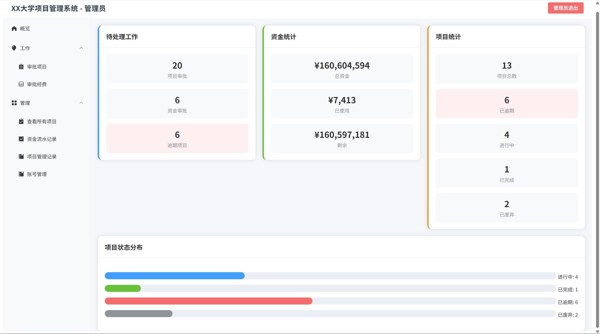
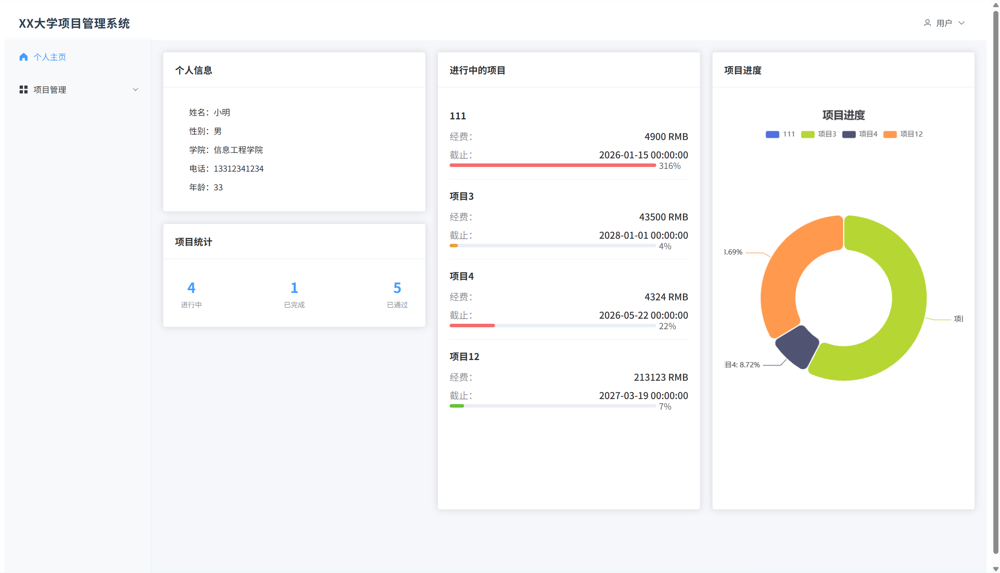
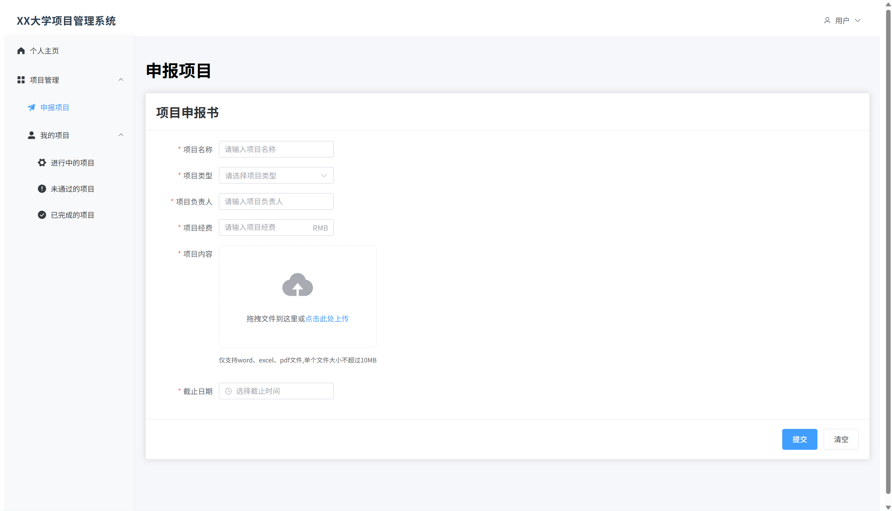
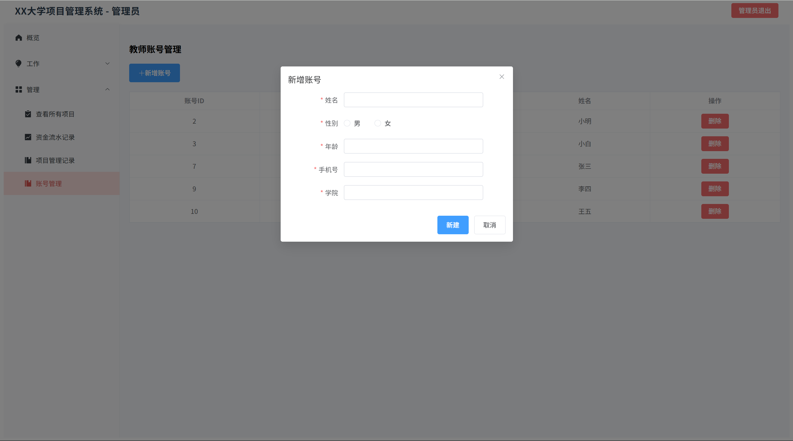
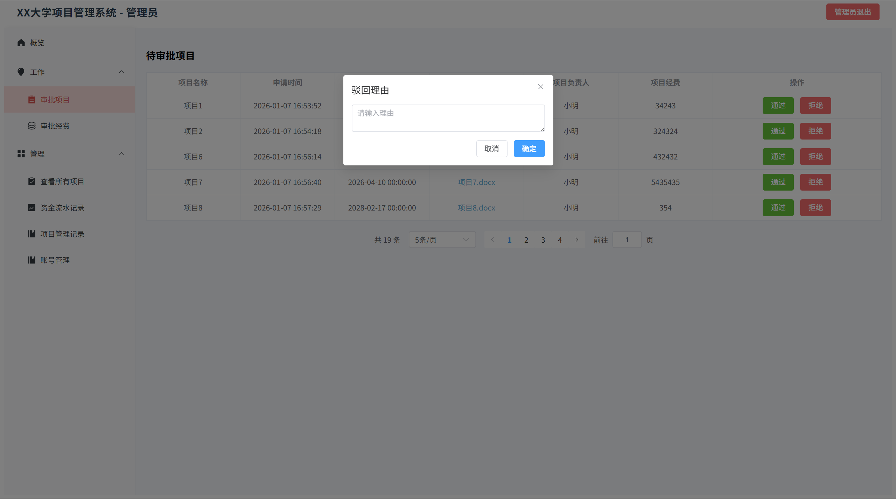
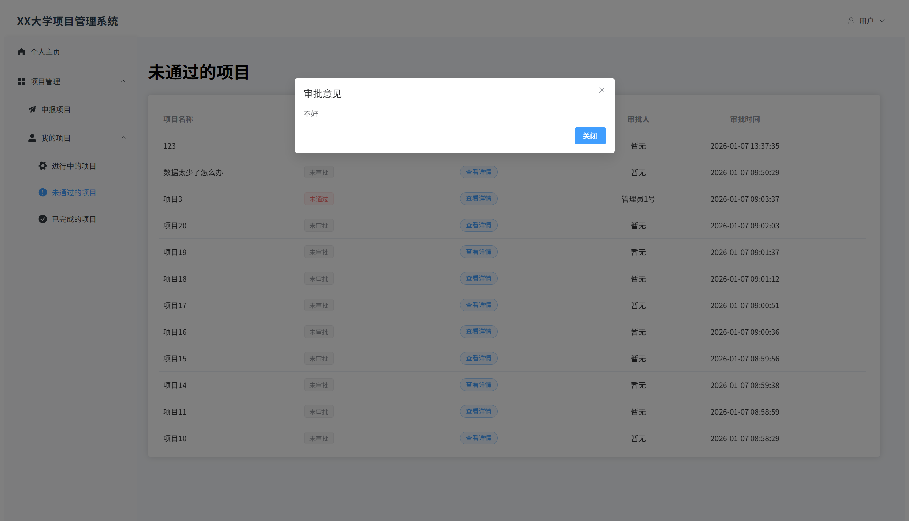
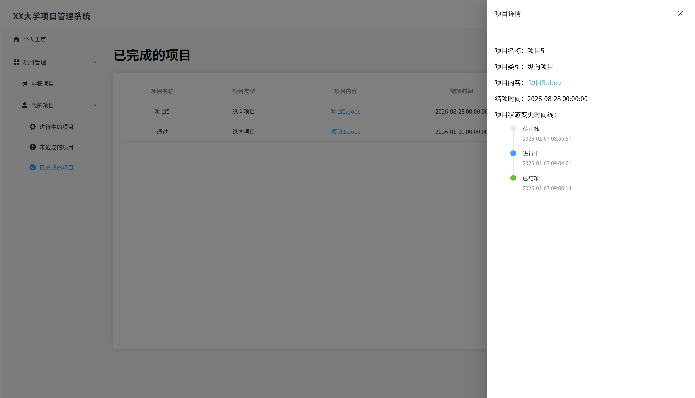
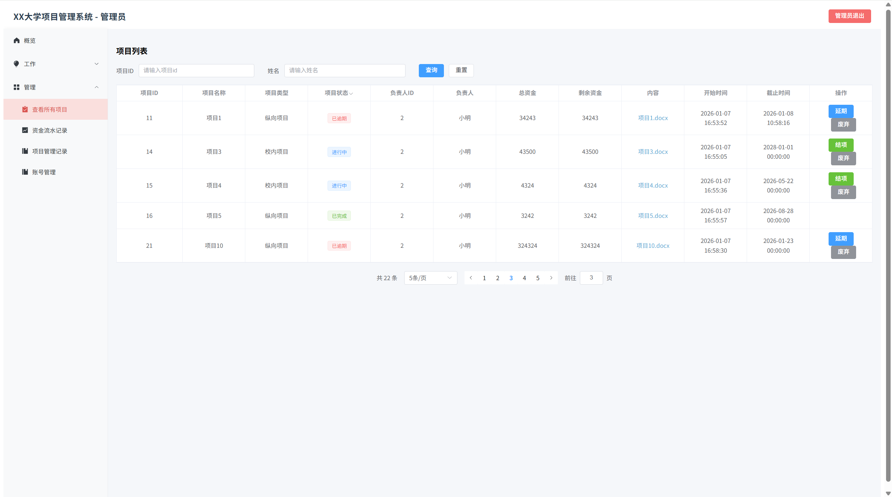

# InvEntropy
Vue+Java——高校项目管理系统


## 项目简介
一个基于 Vue + Element + ECharts + Spring Boot + Mybaties + MySQL + Redis的高校项目管理系统，由登录注册、项目管理功能、统计分析、经费管理四大模块组成，实现登录校验、身份鉴权、项目管理、项目状态自动更新、项目状态追踪、资金流水记录、各类指标统计等功能，适用于前后端、全栈项目练习，数据库课程设计、Web开发课程设计......

## 快速开始

#### 方法一：Docker部署
1.克隆本仓库
```bash
git clone https://github.com/Hsyuan54670/InvEntropy-run.git
```
2.docker compose 一步部署
```
docker compose up -d
```
3.部署完成
- 登录(JWT令牌登录鉴权 + RSA非对称加密)

- 统计分析(ECharts + Element)
  - 管理员

  - 教师

- 项目申报(Element + AliyunOSS)

- 新增账户

- 审批功能(理由传递并且记录)

- 项目查看及其它小功能(教师端虚拟化表格|管理端分页)



#### 方法二：克隆源代码运行
### 环境要求
- Docker部署：需要镜像网站配置或加速服务
- JDK 21.0+
- Nodes.js 11.6.2+
- MySQL 8.0+

### 代码仓库
<!-- 贴仓库克隆命令 + 依赖安装命令，复制就能执行 -->
1. [前端代码仓库(Vue)](https://github.com/Hsyuan54670/InvEntropy-frontend.git)
```bash
git clone https://github.com/Hsyuan54670/InvEntropy-frontend.git
```
2. [后端代码仓库(Java)](https://github.com/Hsyuan54670/InvEntropy-backend.git)
```bash
git clone https://github.com/Hsyuan54670/InvEntropy-backend.git
```